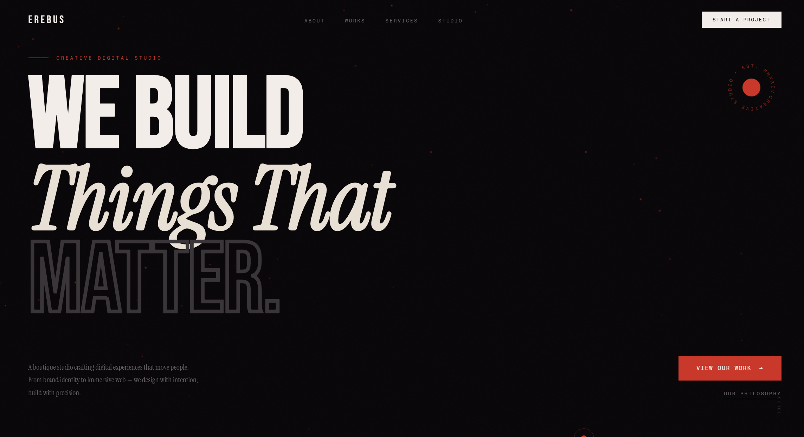

# EREBUS — Creative Digital Studio Landing Page



A cinematic, dark editorial landing page for a fictional creative studio. Built with pure **HTML, CSS, and Vanilla JavaScript** — zero dependencies, zero frameworks, opens instantly in any browser.

## ✦ Live Demo

**[View Live →](https://yourusername.github.io/erebus-landing](https://kuruminyx.github.io/erebus-landing/))**

---

## ✦ Preview

> Dark editorial aesthetic — black canvas, blood red accents, cream typography. Inspired by high-end creative studios like Pentagram, COLLINS, and Sagmeister & Walsh.

---

## ✦ Features

- **Interactive Particle Canvas** — 60+ particles float and connect. Repel on mouse hover, explode on click
- **Custom Cursor** — Smooth lagging ring cursor with hover state reactions
- **Scroll Reveal Animations** — Staggered fade-up entrances using Intersection Observer
- **Auto-rotating Testimonials** — Switches every 5 seconds with smooth fade transition
- **Sticky Nav** — Becomes frosted glass on scroll
- **Infinite Marquee** — Smooth looping ticker strip
- **Responsive** — Works across all screen sizes

---

## ✦ Sections

| Section | Description |
|---|---|
| Hero | Full-viewport headline with outlined ghost text + rotating badge |
| Marquee | Infinite scrolling services ticker |
| About | Two-column layout with geometric frame + offset stat grid |
| Works | Asymmetric project grid (1 wide + 2 half) |
| Services | 6-card grid with animated bottom border reveal |
| Testimonials | Rotating client quotes with manual/auto nav |
| CTA | Ghost background text + centered call to action |
| Footer | Minimal 3-column layout |

---

## ✦ Tech Stack

| Tech | Usage |
|---|---|
| HTML5 | Structure + Canvas API |
| CSS3 | Animations, Grid, Custom Properties |
| Vanilla JavaScript | Particle system, cursor, scroll effects |
| Google Fonts | Bebas Neue + Instrument Serif + Fragment Mono |

**No npm. No build step. No dependencies.**

---

## ✦ Getting Started

```bash
# Clone the repo
git clone https://github.com/yourusername/erebus-landing.git

# Open directly in browser
open index.html
```

That's it. No install needed.

---

## ✦ Customization

### Colors
Edit CSS variables at the top of `index.html`:
```css
:root {
  --black: #080608;
  --white: #f2ede8;
  --red: #c8392b;      /* primary accent */
  --gold: #c9a84c;     /* secondary accent */
}
```

### Images
Replace the Picsum placeholders with real images:
```html
<!-- About frame -->


<!-- Work cards -->

```

### Content
Search for `EREBUS` to find and replace the studio name throughout.

---

## ✦ Fonts Used

- **[Bebas Neue](https://fonts.google.com/specimen/Bebas+Neue)** — Display headings
- **[Instrument Serif](https://fonts.google.com/specimen/Instrument+Serif)** — Italic accent text + body
- **[Fragment Mono](https://fonts.google.com/specimen/Fragment+Mono)** — Labels, captions, nav

---

## ✦ Project Structure

```
erebus-landing/
├── index.html        # Everything — HTML + CSS + JS in one file
├── screenshots/
│   └── preview.png   # README preview image
└── README.md
```

---

## ✦ Deploy on GitHub Pages

1. Go to repo **Settings → Pages**
2. Source: **Deploy from branch → main → / (root)**
3. Save — live in ~60 seconds at `yourusername.github.io/erebus-landing`

---

## ✦ License

MIT — free to use, modify, and build on.

---

<p align="center">Built with obsessive attention to detail · No frameworks harmed</p>
